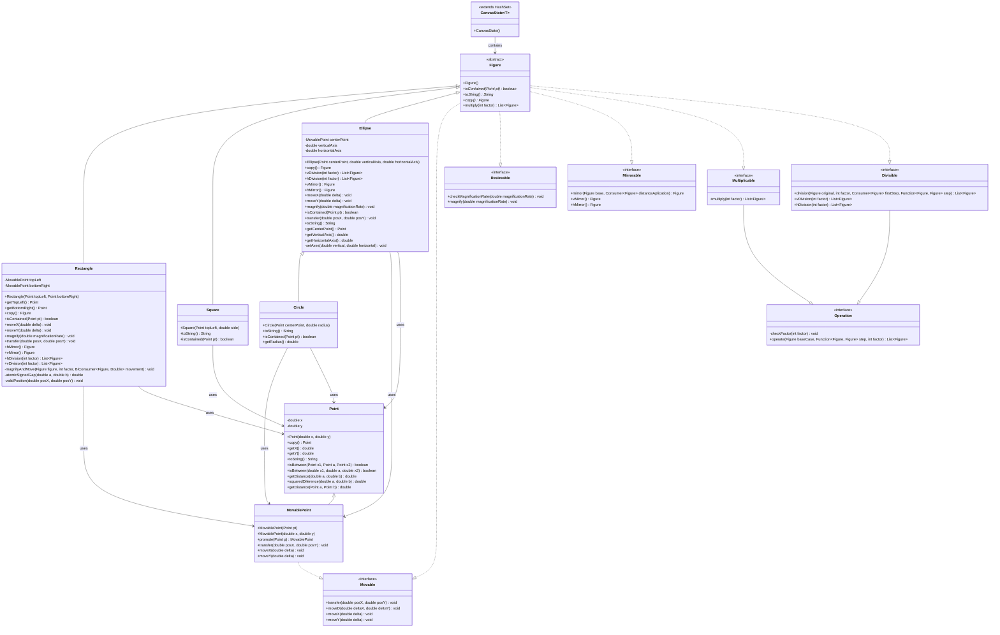

# Diagrama UML - Frontend

```mermaid
classDiagram
    class AppLauncher {
        <<extends Application>>
        +main(String[] args) void
        +start(Stage primaryStage) void
    }

    class MainFrame {
        <<extends VBox>>
        +MainFrame(CanvasState~CustomizeFigure~ canvasState)
    }

    class PaintPane {
        <<extends BorderPane>>
        <<implements FigureStateObserver>>
        -CanvasState~CustomizeFigure~ canvasState
        -Canvas canvas
        -GraphicsContext gc
        -Point startPoint
        -CustomizeFigure selectedFigure
        -Point lastDragPoint
        -StatusPane statusPane
        -Map~FigureOperation, Button~ operationButtons
        +PaintPane(CanvasState~CustomizeFigure~ canvasState, StatusPane statusPane)
        -setupEffectsBar() void
        -setupSidebar() void
        -setupOperationButtons() void
        -setupEffectCheckBoxes() void
        -setupMirrorCheckBoxes() void
        -setupFormatButtons() void
        -setupCanvasEvents() void
        -setupDeleteButton() void
        -executeOperation(FigureOperation operation) void
        -createFigure(Point startPoint, Point endPoint) CustomizeFigure
        -redrawCanvas() void
        +onFigureSelected(CustomizeFigure figure) void
        +onFigureDeselected() void
        +onFigureModified(CustomizeFigure figure) void
    }

    class StatusPane {
        <<extends HBox>>
        +StatusPane()
        +updateStatus(String message) void
    }

    class AppMenuBar {
        <<extends MenuBar>>
        +AppMenuBar()
    }

    class UIComponentFactory {
        <<final>>
        +createSelectButton() ToggleButton
        +createRectangleButton() ToggleButton
        +createCircleButton() ToggleButton
        +createSquareButton() ToggleButton
        +createEllipseButton() ToggleButton
        +createDeleteButton() ToggleButton
        +createDivideHButton() Button
        +createDivideVButton() Button
        +createMultiplyButton() Button
        +createTransferButton() Button
        +createBorderTypeComboBox() ComboBox~BorderType~
        +createColorPicker() ColorPicker
        +createCopyFormatButton() Button
        +createPasteFormatButton() Button
        +createShadowCheckBox() CheckBox
        +createBrightenCheckBox() CheckBox
        +createHorizontalMirrorCheckBox() CheckBox
        +createVerticalMirrorCheckBox() CheckBox
        -setControl(Control ctr) void
    }

    class CustomizeFigure {
        <<abstract>>
        -Format format
        -Figure figure
        -EnumMap~Mirrors, Figure~ mirrors
        +CustomizeFigure(Figure figure, BorderType borderType, Color color)
        +CustomizeFigure(Figure figure, BorderType borderType, Color color, EnumSet~Effects~ effects, EnumSet~Mirrors~ mirrors)
        +CustomizeFigure(Figure figure, Format format)
        +fill(Figure figure, GraphicsContext gc) void*
        +getCopy(Figure figure, Format format) CustomizeFigure*
        +setMirror(Mirrors mirrorType, boolean shouldSet) void
        +setFilter(Effects filter, boolean shouldSet) void
        +clearMirrors() void
        +getMirrors() EnumMap~Mirrors, Figure~
        +multiply(int n) List~CustomizeFigure~
        +hDivision(int n) List~CustomizeFigure~
        +vDivision(int n) List~CustomizeFigure~
        +transferFigure(double x, double y) void
        +figureBelongs(Point point) boolean
        +moveD(double dx, double dy) void
        +format(GraphicsContext gc, CustomizeFigure selected) void
        +getBorderType() BorderType
        +setBorderType(BorderType borderType) void
        +changeColor(Color color) void
        +getOriginalColor() Color
        +getFormatCopy() Format
        +setFormat(Format newFormat) void
        +getFilters() EnumSet~Effects~
        +addFilter(Effects filter) void
        +removeFilter(Effects filter) void
        -operate(Function~Figure, List~Figure~~ operation) List~CustomizeFigure~
        -applyFormat(Figure figure, GraphicsContext gc, Color strokeColor, Color fillColor) void
        -getStrokeColorForFigure(CustomizeFigure figure, CustomizeFigure selected) Color
    }

    class CustomizeFigureBuilder {
        <<enum>>
        RECTANGLE
        SQUARE
        ELLIPSE
        CIRCLE
        +constructor(Point start, Point end, BorderType borderType, Color color, EnumSet~Effects~ effects, EnumSet~Mirrors~ mirrors) CustomizeFigure*
    }

    class CustomizeRectangle {
        +CustomizeRectangle(Point start, Point end, BorderType borderType, Color color, EnumSet~Effects~ effects, EnumSet~Mirrors~ mirrors)
        +CustomizeRectangle(Rectangle figure, Format format)
        +CustomizeRectangle(Figure figure, BorderType borderType, Color color, EnumSet~Effects~ effects, EnumSet~Mirrors~ mirrors)
        +fill(Figure figure, GraphicsContext gc) void
        +getCopy(Figure figure, Format format) CustomizeFigure
    }

    class CustomizeSquare {
        +CustomizeSquare(Point start, Point end, BorderType borderType, Color color, EnumSet~Effects~ effects, EnumSet~Mirrors~ mirrors)
        -makeSquare(Point start, Point end) Square
    }

    class CustomizeEllipse {
        +CustomizeEllipse(Point start, Point end, BorderType borderType, Color color, EnumSet~Effects~ effects, EnumSet~Mirrors~ mirrors)
        +CustomizeEllipse(Ellipse figure, Format format)
        +fill(Figure figure, GraphicsContext gc) void
        +getCopy(Figure figure, Format format) CustomizeFigure
    }

    class CustomizeCircle {
        +CustomizeCircle(Point start, Point end, BorderType borderType, Color color, EnumSet~Effects~ effects, EnumSet~Mirrors~ mirrors)
        +CustomizeCircle(Circle figure, Format format)
        +fill(Figure figure, GraphicsContext gc) void
        +getCopy(Figure figure, Format format) CustomizeFigure
    }

    class Format {
        -Color color
        -BorderType borderType
        -EnumSet~Effects~ filters
        +Format(Color color, BorderType borderType)
        +Format(Color color, BorderType borderType, EnumSet~Effects~ filters)
        +setFormat(Color color, BorderType borderType) void
        +getColor() Color
        +setColor(Color color) void
        +getBorderType() BorderType
        +setBorderType(BorderType borderType) void
        +getFilters() EnumSet~Effects~
        +addFilter(Effects filter) void
        +removeFilter(Effects filter) void
        +nonFilteredCopy() Format
        -getFilteredColor() Color
    }

    class BorderType {
        <<enum>>
        SOLID
        PIXELATED
        DOTTED_THIN
        DOTTED_COMPLEX
        -String description
        -StrokeLineCap strokeLineCap
        -double pxWidth
        -double[] dashes
        +BorderType(String description, StrokeLineCap strokeLineCap, double pxWidth, double... dashes)
        +applyBorder(GraphicsContext gc) void
        +toString() String
    }

    class Effects {
        <<enum>>
        SHADOW
        BRIGHTENING
        -Color filterColor
        -double opacity
        +Effects(Color filterColor, double opacity)
        +applyEffect(Color color) Color
    }

    class Mirrors {
        <<enum>>
        VMIRROR
        HMIRROR
        -Function~Figure, Figure~ mirrorType
        +Mirrors(Function~Figure, Figure~ mirrorType)
        +mirror(Figure figure) Figure
    }

    class Operations {
        <<enum>>
        MULTIPLY
        DIVIDE_H
        DIVIDE_V
        TRANSFER
        -String description
        -String instructions
        +Operations(String description, String instructions)
        +getDescription() String
        +getInstructions() String
        +execute(CustomizeFigure fig, String param) List~CustomizeFigure~*
        +getN(String param) int
        -isInteger(String stringInt) boolean
        -getCoordinates(String param) int[]
    }

    class UIConstants {
        <<final>>
        +DEFAULT_CANVAS_WIDTH double
        +DEFAULT_CANVAS_HEIGHT double
        +DEFAULT_BUTTON_MIN_WIDTH int
        +DEFAULT_COLOR_PICKER Color
        +DEFAULT_STROKE_COLOR Color
        +DEFAULT_SELECTED_STROKE_COLOR Color
        +DEFAULT_BORDER_TYPE BorderType
        +SELECT_BUTTON_TEXT String
        +RECTANGLE_BUTTON_TEXT String
        +CIRCLE_BUTTON_TEXT String
        +SQUARE_BUTTON_TEXT String
        +ELLIPSE_BUTTON_TEXT String
        +DELETE_BUTTON_TEXT String
        +DIVIDE_H_BUTTON_TEXT String
        +DIVIDE_V_BUTTON_TEXT String
        +MULTIPLY_BUTTON_TEXT String
        +TRANSFER_BUTTON_TEXT String
        +SHADOW_BUTTON_TEXT String
        +BRIGHTEN_BUTTON_TEXT String
        +HORIZONTAL_MIRROR_BUTTON_TEXT String
        +VERTICAL_MIRROR_BUTTON_TEXT String
        +EFFECTS_LABEL_TEXT String
        +OPERATIONS_LABEL_TEXT String
        +SIDEBAR_STYLE String
        +EFFECTS_BAR_STYLE String
    }

    %% Relaciones
    AppLauncher --> MainFrame : creates
    AppLauncher --> CanvasState : uses
    
    MainFrame --> PaintPane : contains
    MainFrame --> StatusPane : contains
    MainFrame --> AppMenuBar : contains
    
    PaintPane --> CanvasState : uses
    PaintPane --> CustomizeFigure : manages
    PaintPane --> UIComponentFactory : uses
    PaintPane --> StatusPane : updates
    PaintPane --> Operations : uses
    
    CustomizeFigure <|-- CustomizeRectangle
    CustomizeFigure <|-- CustomizeSquare
    CustomizeFigure <|-- CustomizeEllipse
    CustomizeFigure <|-- CustomizeCircle
    
    CustomizeRectangle <|-- CustomizeSquare
    
    CustomizeFigure --> Format : contains
    CustomizeFigure --> Figure : wraps
    CustomizeFigure --> Mirrors : uses
    
    CustomizeFigureBuilder --> CustomizeRectangle : creates
    CustomizeFigureBuilder --> CustomizeSquare : creates
    CustomizeFigureBuilder --> CustomizeEllipse : creates
    CustomizeFigureBuilder --> CustomizeCircle : creates
    
    Format --> BorderType : uses
    Format --> Effects : uses
    
    UIComponentFactory --> UIConstants : uses
    UIComponentFactory --> BorderType : creates
    UIComponentFactory --> Effects : creates
    
    Operations --> CustomizeFigure : operates on
    Operations --> UIConstants : uses
    
    BorderType --> GraphicsContext : configures
    Effects --> Color : modifies
    Mirrors --> Figure : transforms
```
# Diagrama UML - Backend

```mermaid
classDiagram
    class CanvasState~T~ {
        <<extends HashSet>>
        +CanvasState()
    }

    class Point {
        -double x
        -double y
        +Point(double x, double y)
        +copy() Point
        +getX() double
        +getY() double
        +toString() String
        +isBetween(Point x1, Point a, Point x2) boolean
        +isBetween(double x1, double a, double x2) boolean
        +getDistance(double a, double b) double
        +squaredDiference(double a, double b) double
        +getDistance(Point a, Point b) double
    }

    class MovablePoint {
        +MovablePoint(Point pt)
        +MovablePoint(double x, double y)
        +promote(Point p) MovablePoint
        +transfer(double posX, double posY) void
        +moveX(double delta) void
        +moveY(double delta) void
    }

    class Figure {
        <<abstract>>
        +Figure()
        +isContained(Point pt) boolean*
        +toString() String*
        +copy() Figure*
        +multiply(int factor) List~Figure~
    }

    class Rectangle {
        -MovablePoint topLeft
        -MovablePoint bottomRight
        +Rectangle(Point topLeft, Point bottomRight)
        +getTopLeft() Point
        +getBottomRight() Point
        +copy() Figure
        +isContained(Point pt) boolean
        +moveX(double delta) void
        +moveY(double delta) void
        +magnify(double magnificationRate) void
        +transfer(double posX, double posY) void
        +hMirror() Figure
        +vMirror() Figure
        +hDivision(int factor) List~Figure~
        +vDivision(int factor) List~Figure~
        -magnifyAndMove(Figure figure, int factor, Function~Point, Double~ getter, BiConsumer~Figure, Double~ movement) void
        -atomicSignedGap(double a, double b) double
        -validPosition(double posX, double posY) void
    }

    class Square {
        +Square(Point topLeft, double side)
        +toString() String
        +isContained(Point pt) boolean
    }

    class Ellipse {
        -MovablePoint centerPoint
        -double verticalAxis
        -double horizontalAxis
        +Ellipse(Point centerPoint, double verticalAxis, double horizontalAxis)
        +copy() Figure
        +vDivision(int factor) List~Figure~
        +hDivision(int factor) List~Figure~
        +vMirror() Figure
        +hMirror() Figure
        +moveX(double delta) void
        +moveY(double delta) void
        +magnify(double magnificationRate) void
        +isContained(Point pt) boolean
        +transfer(double posX, double posY) void
        +toString() String
        +getCenterPoint() Point
        +getVerticalAxis() double
        +getHorizontalAxis() double
        -setAxes(double vertical, double horizontal) void
    }

    class Circle {
        +Circle(Point centerPoint, double radius)
        +toString() String
        +isContained(Point pt) boolean
        +getRadius() double
    }

    %% Interfaces de Comportamiento
    class Movable {
        <<interface>>
        +transfer(double posX, double posY) void
        +moveD(double deltaX, double deltaY) void
        +moveX(double delta) void
        +moveY(double delta) void
    }

    class Resizeable {
        <<interface>>
        +checkMagnificationRate(double magnificationRate) void
        +magnify(double magnificationRate) void
    }

    class Mirrorable {
        <<interface>>
        +mirror(Figure base, Consumer~Figure~ distanceAplication) Figure
        +vMirror() Figure
        +hMirror() Figure
    }

    class Multiplicable {
        <<interface>>
        +multiply(int factor) List~Figure~
    }

    class Divisible {
        <<interface>>
        +division(Figure original, int factor, Consumer~Figure~ firstStep, Function~Figure, Figure~ step) List~Figure~
        +vDivision(int factor) List~Figure~
        +hDivision(int factor) List~Figure~
    }

    class Operation {
        <<interface>>
        -checkFactor(int factor) void
        +operate(Figure baseCase, Function~Figure, Figure~ step, int factor) List~Figure~
    }

    %% Relaciones
    CanvasState --> Figure : contains
    
    Point <|-- MovablePoint
    MovablePoint ..|> Movable
    
    Figure <|-- Rectangle
    Figure <|-- Square
    Figure <|-- Ellipse
    Ellipse <|-- Circle
    
    Figure ..|> Movable
    Figure ..|> Resizeable
    Figure ..|> Mirrorable
    Figure ..|> Multiplicable
    Figure ..|> Divisible
    
    Multiplicable --|> Operation
    Divisible --|> Operation
    
    Rectangle --> MovablePoint : uses
    Ellipse --> MovablePoint : uses
    Circle --> MovablePoint : uses
    
    Rectangle --> Point : uses
    Ellipse --> Point : uses
    Circle --> Point : uses
    Square --> Point : uses
```
