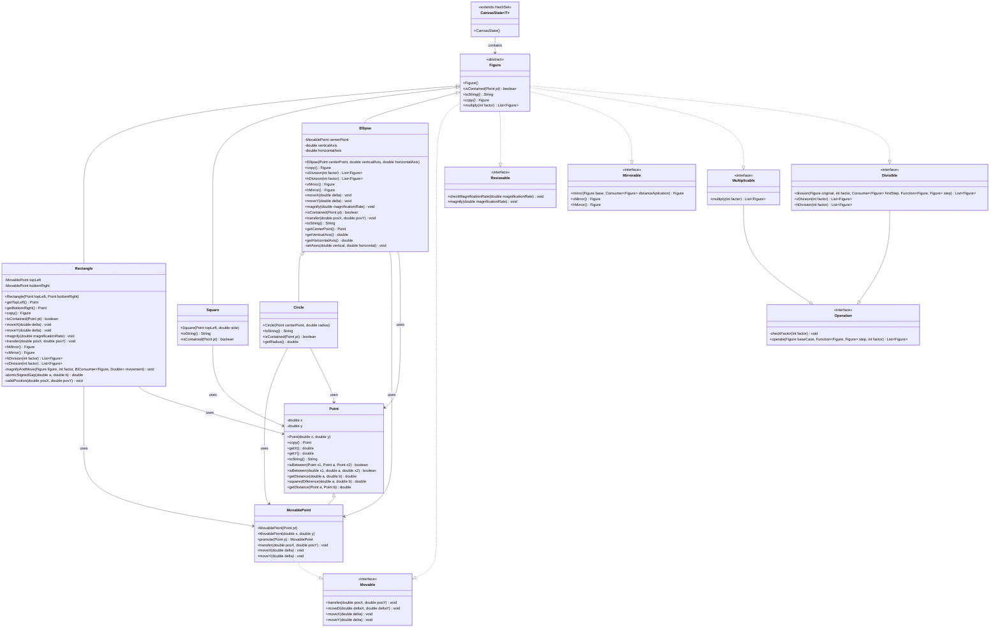

# Diagrama UML - Backend

## Diagrama de Clases del Backend

```mermaid
classDiagram
    class CanvasState~T~ {
        <<extends HashSet>>
        +CanvasState()
    }

    class Point {
        -double x
        -double y
        +Point(double x, double y)
        +copy() Point
        +getX() double
        +getY() double
        +toString() String
        +isBetween(Point x1, Point a, Point x2) boolean
        +isBetween(double x1, double a, double x2) boolean
        +getDistance(double a, double b) double
        +squaredDiference(double a, double b) double
        +getDistance(Point a, Point b) double
    }

    class MovablePoint {
        +MovablePoint(Point pt)
        +MovablePoint(double x, double y)
        +promote(Point p) MovablePoint
        +transfer(double posX, double posY) void
        +moveX(double delta) void
        +moveY(double delta) void
    }

    class Figure {
        <<abstract>>
        +Figure()
        +isContained(Point pt) boolean*
        +toString() String*
        +copy() Figure*
        +multiply(int factor) List~Figure~
    }

    class Rectangle {
        -MovablePoint topLeft
        -MovablePoint bottomRight
        +Rectangle(Point topLeft, Point bottomRight)
        +getTopLeft() Point
        +getBottomRight() Point
        +copy() Figure
        +isContained(Point pt) boolean
        +moveX(double delta) void
        +moveY(double delta) void
        +magnify(double magnificationRate) void
        +transfer(double posX, double posY) void
        +hMirror() Figure
        +vMirror() Figure
        +hDivision(int factor) List~Figure~
        +vDivision(int factor) List~Figure~
        -magnifyAndMove(Figure figure, int factor, Function~Point, Double~ getter, BiConsumer~Figure, Double~ movement) void
        -atomicSignedGap(double a, double b) double
        -validPosition(double posX, double posY) void
    }

    class Square {
        +Square(Point topLeft, double side)
        +toString() String
        +isContained(Point pt) boolean
    }

    class Ellipse {
        -MovablePoint centerPoint
        -double verticalAxis
        -double horizontalAxis
        +Ellipse(Point centerPoint, double verticalAxis, double horizontalAxis)
        +copy() Figure
        +vDivision(int factor) List~Figure~
        +hDivision(int factor) List~Figure~
        +vMirror() Figure
        +hMirror() Figure
        +moveX(double delta) void
        +moveY(double delta) void
        +magnify(double magnificationRate) void
        +isContained(Point pt) boolean
        +transfer(double posX, double posY) void
        +toString() String
        +getCenterPoint() Point
        +getVerticalAxis() double
        +getHorizontalAxis() double
        -setAxes(double vertical, double horizontal) void
    }

    class Circle {
        +Circle(Point centerPoint, double radius)
        +toString() String
        +isContained(Point pt) boolean
        +getRadius() double
    }

    %% Interfaces de Comportamiento
    class Movable {
        <<interface>>
        +transfer(double posX, double posY) void
        +moveD(double deltaX, double deltaY) void
        +moveX(double delta) void
        +moveY(double delta) void
    }

    class Resizeable {
        <<interface>>
        +checkMagnificationRate(double magnificationRate) void
        +magnify(double magnificationRate) void
    }

    class Mirrorable {
        <<interface>>
        +mirror(Figure base, Consumer~Figure~ distanceAplication) Figure
        +vMirror() Figure
        +hMirror() Figure
    }

    class Multiplicable {
        <<interface>>
        +multiply(int factor) List~Figure~
    }

    class Divisible {
        <<interface>>
        +division(Figure original, int factor, Consumer~Figure~ firstStep, Function~Figure, Figure~ step) List~Figure~
        +vDivision(int factor) List~Figure~
        +hDivision(int factor) List~Figure~
    }

    class Operation {
        <<interface>>
        -checkFactor(int factor) void
        +operate(Figure baseCase, Function~Figure, Figure~ step, int factor) List~Figure~
    }

    %% Relaciones
    CanvasState --> Figure : contains
    
    Point <|-- MovablePoint
    MovablePoint ..|> Movable
    
    Figure <|-- Rectangle
    Figure <|-- Square
    Figure <|-- Ellipse
    Ellipse <|-- Circle
    
    Figure ..|> Movable
    Figure ..|> Resizeable
    Figure ..|> Mirrorable
    Figure ..|> Multiplicable
    Figure ..|> Divisible
    
    Multiplicable --|> Operation
    Divisible --|> Operation
    
    Rectangle --> MovablePoint : uses
    Ellipse --> MovablePoint : uses
    Circle --> MovablePoint : uses
    
    Rectangle --> Point : uses
    Ellipse --> Point : uses
    Circle --> Point : uses
    Square --> Point : uses
```
